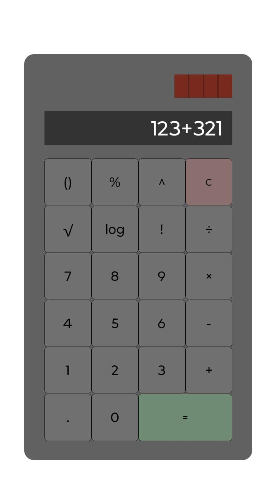

# Calculator - React Native

Este é um simples aplicativo de calculadora desenvolvido utilizando **React Native**. O aplicativo permite realizar operações de adição, subtração, multiplicação, divisão, exponenciação, fatorial, logaritmo, raiz quadrada e porcentagem. 

## Aparência

<div align="center">
    
</div>

## Funcionalidades

- **Operações básicas:** Adição, subtração, multiplicação e divisão

- **Operações avançadas:** Exponenciação, Cálculo de fatorial, Logaritmo (base 10), Raiz quadrada e Porcentagem.

## Ferramentas e Tecnologias

 

- React Native
- TypeScript

## Instalação

1. **Clonando o repositório**:

   ```bash
   git clone https://github.com/RaykkonerD/calculator.git
   cd calculator
   ```

2. **Instalando dependências**:

   Certifique-se de ter o [Node.js](https://nodejs.org/) e [React Native CLI](https://reactnative.dev/docs/environment-setup) instalados.

   Em seguida, instale as dependências do projeto com:

   ```bash
   npm install
   ```

3. **Executando o aplicativo**:

   Caso tenha o dispositivo Android ou iOS com o aplicativo Expo GO, execute:
   
     ```bash
     npm start
     ```

    E aponte o a câmera, com o leitor de QR Code aberto, para o QR Code que aparecer no terminal.

   Caso tenha o ambiente configurado para Android ou iOS, execute:

   - Para **Android**:

     ```bash
     npx react-native run-android
     ```

   - Para **iOS** (somente macOS):

     ```bash
     npx react-native run-ios
     ```

4. **Testando o aplicativo**:

   Após a execução bem-sucedida, o aplicativo abrirá em seu emulador/dispositivo físico. Você pode começar a adicionar, editar e excluir tarefas.

## Estrutura do Código

O código é principalmente de um único arquivo:

- **App.tsx**: Componente principal que gerencia e renderiza a calculadora.

## Estilos

Os estilos do aplicativo são criados usando o `StyleSheet` do React Native. A interface contém um input onde são exibbidos os valores, botões com os números, as funções e as operações e a estrutura da calculadora, incluindo uma simulação de painéis solares, em alusão ao elemento presente em muitas calculadoras antigas.

## Contribuindo

Se você quiser contribuir com melhorias, correções ou novas funcionalidades, sinta-se à vontade para abrir um **Pull Request**. Certifique-se de seguir o estilo de código e de testar suas alterações antes de enviar.
